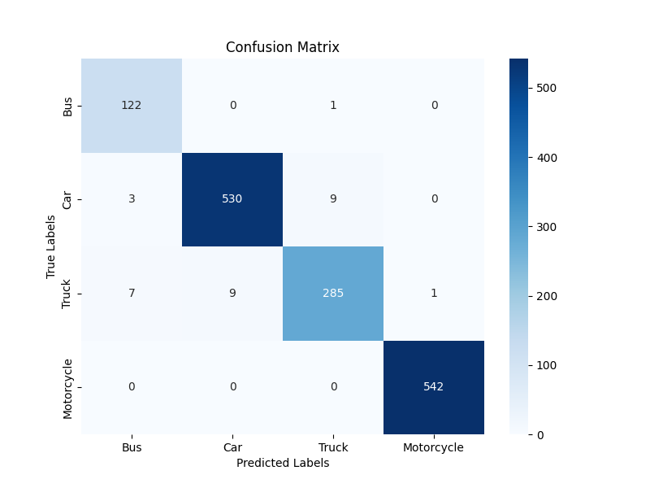

# Vehicle Type Classification

This project is a machine learning-based application for classifying images of vehicles into four categories: **Bus**, **Car**, **Truck**, and **Motorcycle**. The solution uses multiple Convolutional Neural Networks (CNNs) with Transfer Learning (MobileNetV2, ResNet50, DenseNet121) to ensure high accuracy and scalability.

## Features

- **Model Training:** Utilizes Transfer Learning with MobileNetV2, ResNet50, and DenseNet121 to classify vehicle images. Handles class imbalance with computed class weights and includes data augmentation (rotation, flipping, zooming).
- **Prediction:** Predicts labels for single images and visualizes predictions with true labels and confidence scores.
- **Random Image Testing:** Selects random images from the dataset and evaluates predictions with visual outputs.
- **Data Preparation:** Renames files within folders for easier organization and processing.
- **Evaluation:** Computes a confusion matrix and classification report to analyze model performance.

## Dataset

The dataset used for this project can be downloaded from the following link:
[Download Dataset](https://drive.google.com/drive/folders/1hpdSMkNkjEXOOlL6qusAZnkRv6Rf9RED)

## Folder Structure

- `dataset`: Contains subfolders for each vehicle type (`Bus`, `Car`, `Truck`, `Motorcycle`).
- `modelAccuracyAndEpochs`: Stores training accuracy and validation accuracy plots for each model (MobileNetV2, ResNet50, DenseNet121).
- `prediction`: Stores output images for random and single image predictions for each model.
- **Scripts:**
  - `model.py`: MobileNetV2 model training and saving.
  - `model2.py`: ResNet50 model training and saving.
  - `model3.py`: DenseNet121 model training and saving.
  - `randomImages.py`: Random image selection, prediction, and output generation.
  - `rename.py`: Script to rename dataset images.
  - `testing.py`: Single image prediction and visualization.
  - `ConfusionMatrix.py`: Evaluates the model using a confusion matrix and classification report.

## Requirements

### Libraries

- Python 3.7-3.10
- TensorFlow
- NumPy
- Matplotlib
- Scikit-learn
- Seaborn
- PIL (Pillow)

### Installation

```bash
git clone https://github.com/syedimrantirmizi/VehicleTypeClassification-AI-Project
cd VehicleTypeClassification
pip install tensorflow numpy matplotlib scikit-learn seaborn pillow
```

## How to Use

### 1. Train the Models

- Train MobileNetV2:
  ```bash
  python model.py
  ```
- Train ResNet50:
  ```bash
  python model2.py
  ```
- Train DenseNet121:
  ```bash
  python model3.py
  ```

Each script:

- Loads the dataset.
- Applies data augmentation and class balancing.
- Trains a CNN using the specified architecture.
- Saves the trained model (e.g., `vehicle_classifier_mobilenetv2.h5`).

### 2. Predict Single Image

```bash
python testing.py
```

Modify `test_image_path` to specify your image.
- **Predicted Images:**
  - `singleimagetest/output.png`: True vs Predicted labels for the specific images.
  - `singleimagetest/confidence_scores.png`: Confidence scores for specific image.

### 3. Test Random Images

```bash
python randomImages.py
```
Selects 10 random images and generates:

- **Predicted Images:**
  - `randomimagestest/output.png`: Displays all selected images with true and predicted labels.
  - `randomimagestest/confidence_scores.png`: Lists confidence scores for each image.

### 4. Rename Dataset Images (Skip if you are using the provided dataset)

```bash
python rename.py
```

Renames all images in the `Given Path` folder.

### 5. Evaluate the Model

```bash
python ConfusionMatrix.py
```

Computes a confusion matrix and displays a classification report for each model.

## Outputs

- **Training Plots:** Accuracy and validation accuracy over epochs for each model.
- **Confusion Matrix:** Heatmap of the confusion matrix for performance evaluation.
- **Predicted Images:**
  - Random and single image predictions stored in `prediction/<ModelName>`.

## Example Outputs

### Predicted Labels

```plaintext
True Label: Car
Predicted Label: Truck
Confidence Scores:
Bus: 2.34%
Car: 89.45%
Truck: 5.67%
Motorcycle: 2.54%
```

### Confusion Matrix

Each model produces a confusion matrix for performance evaluation. For example:



## Authors

This project was developed by:

- **Syed Imran Tirmizi**
- **Subhan Akhter**
- **Hashir Naveed**
- **Izhan Rehan**
